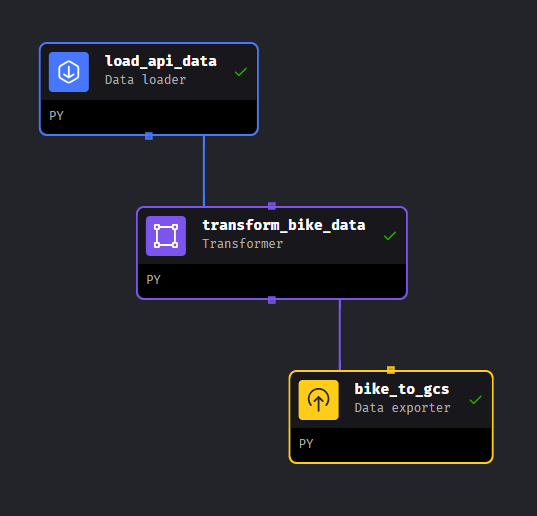
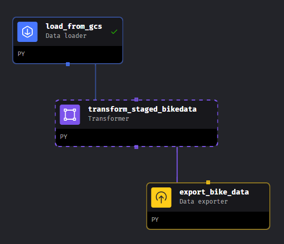

# Project Capital Bikeshare
## Navigation / Quick Access
Quickly move to section you are interested in by clicking on appropriate link:
- [Overview](https://github.com/EdidiongEsu/capital_bikeshare/tree/main#overview)
- [Project Objective](https://github.com/EdidiongEsu/capital_bikeshare/tree/main#project-objective)
- [Project Architecture](https://github.com/EdidiongEsu/capital_bikeshare/tree/main#project-architecture)
- [Dataset](https://github.com/EdidiongEsu/capital_bikeshare/tree/main#dataset)
- [Technologies](https://github.com/EdidiongEsu/capital_bikeshare/tree/main#technologies)
- [Reproducing Project](https://github.com/EdidiongEsu/capital_bikeshare/tree/main#reproducing-project) (long section)
- [Dashboard](https://github.com/EdidiongEsu/capital_bikeshare/tree/main#dashboard)

---
## Overview
This project extracts, moves and analyzes DC's [Capital Bikeshare](https://ride.capitalbikeshare.com) data.

Where do Capital Bikeshare riders go? When do they ride? How far do they go? Which stations are most popular? What days of the week are most rides taken on? 
This project successfully attempts to extract the data, move, store and analyze the insights to answer some key questions about Washighton DC's Capital BikeShare.

This project was created as part of the requirement needed for [DataTalksClub](https://github.com/DataTalksClub/data-engineering-zoomcamp/tree/main) certification.

---
## Project Objective
Succesfully move data from Source, transform and Visualize in a dashboard.
Key Deliverables:
- Create end to end pipeline to move data by batching to analytical warehouse
- Design and build analytical dashboard to showcase insights

---
## Project Architecture

The data architecture is an overview of the end-to-end pipeline which include:
- Ingesting of source dataset to google cloud storage
- Moving data and staging in a dataware house which is big query
- transforming the data using dbt via dbt cloud
- Creation of dashboard with Looker studio

---
## Dataset
The project's data source can be accessed [here](https://ride.capitalbikeshare.com/system-data)

Dataset columns from source:
- ride_id - Unique key for each ride
- rideable_type - Bike type used
- started_at – Includes start date and time
- ended_at – Includes end date and time
- start_station_name – Includes starting station name
- start_station_id - Unique id of start station
- end_station_name – Includes ending station name
- end_station_id - Unique id of ending station
- start_lat - Start Latitude of bike trip
- start_lng - Start Longitude of bike trip
- end_lat - Latitude the bike trips end
- end_lng - Longitude the bike trips end
- member_casual- Indicates whether user was a "registered" member (Annual Member, 30-Day Member or Day Key Member) or a "casual" rider (Single Trip, 24-Hour Pass, 3-Day Pass or 5-Day Pass)

---
## Technologies
- [Docker](https://www.docker.com/):- Containerization of applications -- build, share, run, and verify applications anywhere — without tedious environment configuration or management.
- [Google Cloud Storage](https://cloud.google.com/storage) GCS - Data Lake for storage
- [Google Cloud BigQuery](https://cloud.google.com/bigquery) - Data warehouse for analytical purposes
- [Terraform](https://www.terraform.io/) - Infrastructure as code (Infrastructure automation to provision and manage resources in any cloud or data center.)
- [Mage](https://docs.mage.ai/introduction/overview) -  Data and workflow orchestration 
- [Dbt](https://www.getdbt.com/)- For analytics engineering via data transformation
- [Looker studio](https://lookerstudio.google.com/) - Data Visualization

---
## Reproducing project
This section will give a thorough breakdown of how to reproduce this project

### 1) Pre-requisites
1) Set up GCP account
2) Install terraform on machine via this [link](https://developer.hashicorp.com/terraform/install) and watch this [tutorial](https://www.youtube.com/watch?v=Y2ux7gq3Z0o&list=PL3MmuxUbc_hJed7dXYoJw8DoCuVHhGEQb&index=12&pp=iAQB) on terraform basics
3) Install Docker via this [link](https://docs.docker.com/engine/install/)

### 2) Google Cloud Platform (GCP)
- Setup up GCP free account if you don't have an account. It expires after 90 days.
- Create a new project and take note of the project ID.
- Set up service account. Select Bigquery Admin, Compute Admin and storage Admin Roles for this project.
- Once account is created, create and download the key file. This will be used to authenticate google services. This will be needed for Mage, DBT.

### 3) Terraform
Terraform is infrastructure as cloud and it will be used to create and destroy GCP resources. Follow the instructions below to create similar resources:

1. Go to a your terminal. Create a new directory `mkdir` and name **capital_bikeshare**. Alternatively you can clone this repository.
2. Naviage `cd` into the terraform directory. My resources are created for region **EU**. Create and copy contents from the **variables.tf** and **main.tf** file. 
3. Edit the **variables.tf** file to match the required region you need your project to be. Mine was **EU**.
4. In this file you need to change the **project ID**, **region**, **vm_image** accordingly. The variable.tf file has been commented to assist you. vm_image creates a compute engine instance which is basically a remote computer. Edit to match your system requirements for optimal performance. I choose an Ubuntu (Linux), 16 gigg ram compute.
5. Ensure that terraform has already been installed locally. Also ensure that compute instance api and big query API has been enabled.
6. Run the `terraform init` command to get the cloud provider (in this instance Google)
7. Run `terraform plan` to show changes required by the current configuration.
8. Then `terraform apply` to create and update infrastructure. Based on the available file, 5 resources will be created. If you receive any error that a resource already exists, please rename resource names as appropraite.
9. **Do this only when necessary** --- Use `terraform destroy` to destroy previously-created infrastructure.
10. (Optional if are using compute engine) -- Create an ssh to connect with your compute instance. You can refer to this [Video](https://www.youtube.com/watch?v=vw-j8Tm3OmM) and this [longer Video](https://www.youtube.com/watch?v=ae-CV2KfoN0&list=PL3MmuxUbc_hJed7dXYoJw8DoCuVHhGEQb&index=15) for detailed explanation and how to connect via Vs code.
11. The second Video shows how to create a config file to aid update and manage the External IPs of the compute instance anytime you suspend/restart the compute instance. Remember the compute engine is a virtual machine and a local machine can be used for this project but it does make things easier.
12. Go to your terminal and ssh into your remote instance.

    

13) The remote instance is bare and so install the necessary packages and git clone this repository.

### 4) Mage 
1. `cd` into the mage directory. Rename `dev.env` to `.env`. You will notice there are some postgres configurations there. That can be removed. 
2. Ensure that docker has already been installed as indicated above.
3. Run `docker compose build` to build mage using docker.
4. Once the image has been created. Run `docker compose up -d` in your terminal to initialize the mage application. Ensure your port has been forwarded since you are on a virtual machine (if you used the compute instance).

5. Navigate to http://localhost:6789 in your browser to access mage application
6. Your file structure in mage will look like this:

    

7. Go to edit pipelines and create the pipelines to resemble the structure below and code in the pipeline folders. Ensure to edit resource name in code to match yours.

<table align="center">
<tr align="center">
<td>  </td>
<td>  </td>
<tr>
<td>1. Pipeline to move data from S3 to gcs</td>
<td>2. Pipeline to move data from gcs to big query</td>
</tr>
</tr>
</table>

You can watch this [Video](https://www.youtube.com/watch?v=w0XmcASRUnc&list=PL3MmuxUbc_hJed7dXYoJw8DoCuVHhGEQb&index=24&pp=iAQB) and the playlist to understand more.
8. Execute Pipelines in the order above, then you should have data in big query.

### 5) DBT
I used dbt cloud for this project but you can decide to code locally. Refer to [Video](https://www.youtube.com/watch?v=uF76d5EmdtU&list=PL3MmuxUbc_hJed7dXYoJw8DoCuVHhGEQb&index=40&pp=iAQB) and follow up Videos in that section for more guidance on dbt in general including how to develop and deploy dbt models.

1. Create a free account on dbt cloud
2. Create a project and connect to big query. Create a new key from the same service account you created to be used for dbt. Watch [this](https://www.youtube.com/watch?v=COeMn18qSkY) for more assistance. Specify location to EU if you're using a GCP resource created there.
3. Replicate file contents are in the `dbt/capital_share` folder. File structure would look like

    

4. When done, DAG should resemble this:

5. Compile and build `dbt build` model. A $\color{green}{successful}$ build is $\color{green}{green}$

6. if successfully, your dataset in bigquery would look like.

    

7. Go to deploy code on dbt cloud. Create a production environment, create a run and trigger the run manually.

Check [here](https://www.youtube.com/watch?v=V2m5C0n8Gro&list=PL3MmuxUbc_hJed7dXYoJw8DoCuVHhGEQb&index=46&pp=iAQB) and corresponding Videos for more guidance.

8. Two new columns, `duration` and `distance` are created during the dbt transformation. Refer to this [code](https://github.com/EdidiongEsu/capital_bikeshare/blob/main/dbt/capital_bikeshare/models/core/fact_bike_trips.sql) for the details

### 6) Looker Studio
1) Create a blank report on looker
2) Select the bigquery connector and connect to the transformed data in the dbt production warehouse
3) Start building dashboard
4) Several calculated fields are created in order to create dashboard in next section.

---
## Dashboard
The live dashboard created as part of this project can be viewed and interacted with [here](https://lookerstudio.google.com/reporting/51073509-b2e1-4909-a20f-60d02f303c1d)

Two dashboard pages were created as shown below:

## Contact
Please reach out to me on [LinkedIn](https://www.linkedin.com/in/edidiong-esu-1942a2129/) for thoughts and/or issues encountered during reproduction of project. Let's chat! :star:.

**Happy Coding!** :computer:

